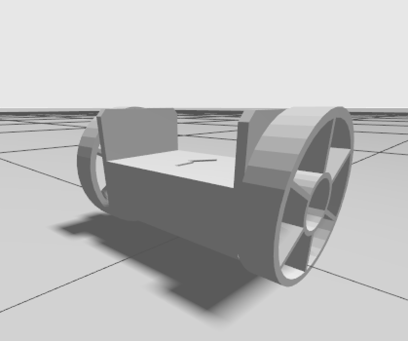

# bp001 Gazebo Sim

这是一个基于 ROS 2 Jazzy + Gazebo Sim 的两轮平衡车仿真工程，当前已经具备：

- 基于 LQR 的稳定平衡控制
- 基于 `/cmd_vel` 的保守速度控制接口
- 一键启动的仿真链路
- 精简后的配套文档
- 适合作为 ROS 2 + Gazebo Sim 两轮平衡车入门示例



## 快速开始

```bash
source /opt/ros/jazzy/setup.bash
cd /home/umas/prj/biped001_sim_gazebo
colcon build --symlink-install
source install/setup.bash
ros2 launch bp001_sim sim.launch.py
```

如果你之前异常关闭过仿真，建议先清理残留进程：

```bash
pkill -f "ros2 launch bp001_sim sim.launch.py|gz sim -s -r /home/umas/prj/biped001_sim_gazebo/install/bp001_sim/share/bp001_sim/worlds/empty.sdf|ros_gz_bridge/parameter_bridge|install/bp001_control/lib/bp001_control/balance_controller|ros_gz_sim/create"
```

## 速度控制

启动后可通过标准 ROS 话题发送速度命令：

```bash
ros2 topic pub /cmd_vel geometry_msgs/msg/Twist "{linear: {x: 0.08}, angular: {z: 0.0}}" -r 10
```

当前默认参数以稳定优先，建议先使用 `0.05 ~ 0.10 m/s` 的小速度验证。
当前配置下不要直接使用 `0.8 m/s`，这远超当前稳定调参范围。

## 项目定位

这个版本的目标是作为一个可运行、可阅读、可复现的 HelloWorld 级两轮平衡车仿真项目：

- 重点是完整链路清晰
- 重点是控制结构可理解
- 重点是新用户可以直接启动、观察和继续扩展
- 当前不以高动态性能或高速运动为目标

## 文档

文档现在收敛成 3 份：

- 初学者导览：
  [`docs/beginner_guide.md`](/home/umas/prj/biped001_sim_gazebo/docs/beginner_guide.md)
- 最小 LQR 说明：
  [`docs/minimal_lqr_demo.md`](/home/umas/prj/biped001_sim_gazebo/docs/minimal_lqr_demo.md)
- 工程实现说明：
  [`docs/implementation.md`](/home/umas/prj/biped001_sim_gazebo/docs/implementation.md)

建议阅读顺序是：`beginner_guide -> minimal_lqr_demo -> implementation`。
